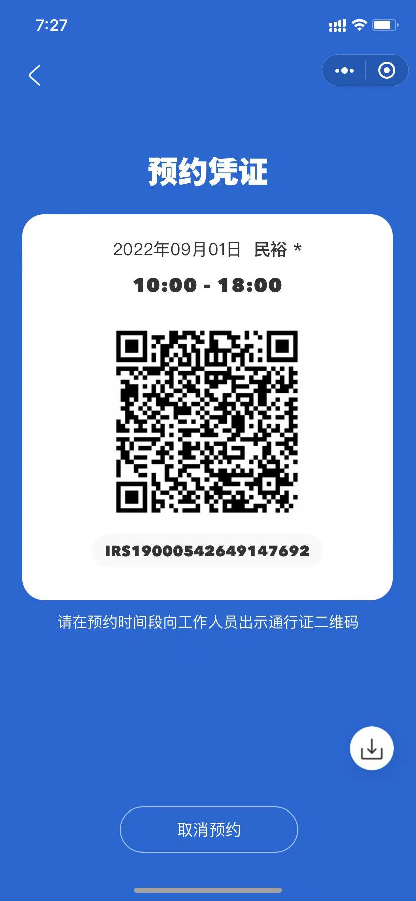

# 北京旅游计划

## 车票预定

### 出发

- **时间**：  
    08.31上午
- **路线**：  
    上海——>北京
- **车次及座位**:  

### 返程

- **时间**：  
     09.05上午看完升旗后
- **路线**：  
     北京——>合肥——>金寨
- **车次及座位**:  

## 路线规划

- **08.31**  
[南锣鼓巷](https://www.xiaohongshu.com/discovery/item/614b1c37000000000102ec10?source=question)
[前门大栅栏](http://z.mafengwo.cn/pandian/206245-1.html)
[天坛](http://www.mafengwo.cn/gonglve/ziyouxing/148963.html)
- **09.01**  
[环球影城](https://baijiahao.baidu.com/s?id=1710664637892660783&wfr=spider&for=pc) [门票](#环球门票)
- **09.02**  
[八达岭长城](https://www.jy135.com/lvxing/323024.html)
[颐和园](https://view.inews.qq.com/a/20220510A03D9G00)
[圆明园](https://zhuanlan.zhihu.com/p/419481741)
[清华(北大)]
[奥林匹克公园(鸟巢水立方)](https://www.sanjiangdai.com/lvyou/4128.html)

- **09.03**  
[天安门广场](http://www.k1u.com/jingdian/60229.html)
[故宫](https://baijiahao.baidu.com/s?id=1725271935933561474&wfr=spider&for=pc)
[毛主席纪念堂](http://cpc.people.com.cn/n1/2022/0704/c143528-32465636.html)
[鼓楼]
[什刹海](https://www.maigoo.com/citiao/103896.html)
- **09.04**  
[升旗](https://www.sohu.com/a/508550089_120099892) [预约](#升旗预约)

## 景点预约以及门票预定

### 环球影城

#### 环球门票

09.01 10:00-18:00  
凭借身份证直接入园

#### 环球园区预约

### 天安门

#### 升旗预约

### 颐和园

### 故宫

22号预约，限量10000张！！！

### 毛主席纪念堂

### 八达岭长城
